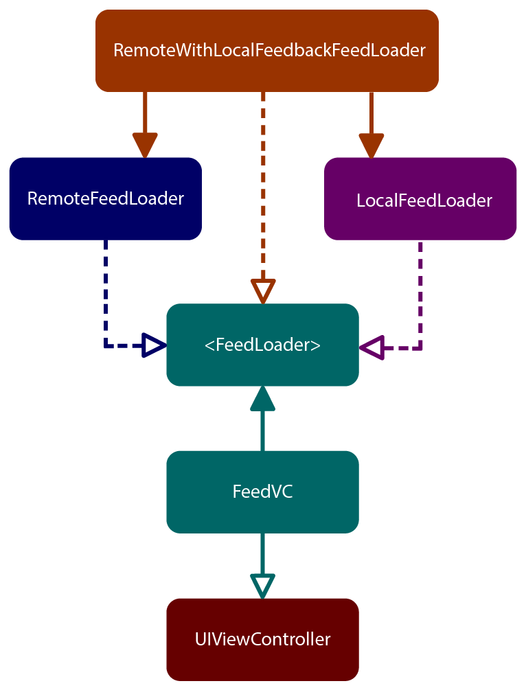

# Intro to Dependency Diagrams and Composition

Source: essentialdeveloper.com

How diagrams translate into code and vice versa dependencies and abstractions with SOLID principles and composition.

